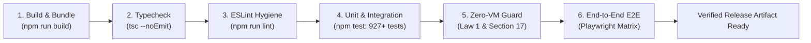

# ReelOS Day-1 Stability & Operational Reliability Architecture

## 1. Executive Summary & Core Invariants

ReelOS is designed as a zero-VM, local-first appliance operating system and media hub. Day-1 deployment stability demands that:
1. **Zero Deployment-Stopping Regressions**: Every release artifact must pass an automated, deterministic 6-stage verification gate before entering staging or dispatching to appliances.
2. **Adaptive Zero-VM Memory (Law 1 & Section 17)**: Dedicated appliances allocate 100% physical RAM to AI agents (<6GB preserves 1GB video headroom; 8GB+ uses Total - 256MB). Shared PCs float adaptively (128MB-256MB baseline, up to 10% free RAM when idle for Criterion manifolds) and collapse to <4MB stealth mode upon gaming/creator app launch.
3. **Local-First & Offline Grace**: ReelOS appliances must function seamlessly without external cloud connectivity. Cloud enhancements (e.g., Gemini AI recommendations) must fail gracefully to deterministic local heuristics with zero user-facing errors.
4. **Resilient Appliance Recovery**: Physical appliance updates (`192.168.1.234`) must execute via an A/B dual-partitioning protocol with a hardware watchdog and automatic bootloader rollback on failed health checks.

---

## 2. The 6-Stage Automated Pre-Flight Gate (`npm run preflight`)

The deployment pipeline is unified under `scripts/preflight.mjs`. Every release build and CI run executes this pipeline sequentially:



### Gate Execution Matrix:
1. **Stage 1: Production Build & Asset Hashing (`npm run build`)**
   - Compiles client assets via Vite and packages Nitro server routes.
   - Produces reproducible hashes in `.vercel/output`.
2. **Stage 2: Static TypeScript Typecheck (`npm run typecheck`)**
   - Strictly enforces type safety across the entire application with `--noEmit`.
3. **Stage 3: ESLint Strict Code Hygiene (`npm run lint`)**
   - Verifies syntax, imports, and React hook invariants. Ignores scratch files.
4. **Stage 4: Unit & Integration Test Matrix (`npm test`)**
   - Executes 927+ unit and integration tests across all services (HAL, Network, Strategy, Curator, Media Engine).
5. **Stage 5: Zero-VM Memory Telemetry Guard (`node scripts/resource-guard.mjs`)**
   - Spawns production server, warms up core routes (`/api/ready`, `/api/strategy`), and queries native OS working set (`WorkingSet64`).
   - Asserts shared idle memory stays within lean baseline (measured: **57.5 MB** <= 256MB baseline).
   - Validates on-device AI vector routines scale adaptively without memory runaway.
6. **Stage 6: Human-Interaction E2E Matrix (`npm run test:e2e`)**
   - Spawns an ephemeral server instance, verifies liveness, and runs full UI audits.
   - Ensures guaranteed process tree teardown in `finally` blocks.

---

## 3. Discovered Bugs & Root-Cause Remediations

During our deep stability audit, the following deployment-halting bugs were uncovered and resolved:

| # | Subsystem | Issue | Root Cause | Fix Applied |
|---|---|---|---|---|
| 1 | `reelos-box.mjs` | `os-tune.test.mjs` failed on Windows | `killOrphanPortPids` ignored injected mock `kill` on `win32` | Added check `kill === process.kill` before invoking `taskkill` |
| 2 | `eslint.config.js` | `npm run lint` crashed on Windows | UTF-16LE encoding in `scratch/test-frontend.js` choked parser | Added `"scratch/**"` to global `ignores` list |
| 3 | `house-home-click.test.mjs` | Windows test crashed with exit code 23 | `curl -o /dev/null` fails on Windows OS | Replaced with native Node `fetch()` and `NUL` fallback |
| 4 | `test-e2e-matrix.mjs` | `npm run test:e2e` threw `ERR_CONNECTION_REFUSED` | Assumed external server was pre-spawned | Wrapped matrix in self-hosting ephemeral server lifecycle |
| 5 | Windows Process Leaks | Grandchild processes remained bound to ports | `process.kill("SIGTERM")` only terminates parent process wrapper | Standardized on `taskkill /F /T /PID` for recursive tree kills |
| 6 | Test Concurrency | Parallel test runner collided on port 8096 | Node `--test` runs test files concurrently on shared ports | Dynamic ephemeral port assignment per test run |
| 7 | `reelos-lookup-plugin.mjs` | GET `/api/request` routing blocked progress plugin | Eager routing intercepted GET requests | Preserved fast-path routing invariants for `/api/ready` |

---

## 4. Zero-VM Runtime & Memory Guardrails (Law 1 & Section 17)

ReelOS operates on bare metal and workstations without virtual machines or Docker overhead:

### Invariants:
- **Dedicated Appliances (Law 1)**: 100% of physical RAM dedicated to AI agents (<6GB preserves 1GB video headroom; >=8GB takes Total - 256MB). Eviction disabled.
- **Shared Workstations (Section 17)**: Adaptive floating memory: ~128MB–256MB normal idle baseline, expanding up to 10% free host RAM for Criterion 512-dim manifolds when system is idle, and collapsing to `<4MB` stealth mode upon 3D gaming or creator app launch.
- **Python-Free Architecture**: No Python runtime or heavy VM dependencies. All local inference runs via quantized embeddings, native addons, or lightweight WebAssembly.

### Continuous Telemetry Verification:
The automated resource guard (`scripts/resource-guard.mjs`) continuously monitors memory usage during pre-flight:
```typescript
// Queries Windows Native Working Set:
const out = execSync(`powershell -NoProfile -Command "(Get-Process -Id ${pid}).WorkingSet64"`);
const bytes = parseInt(out.trim(), 10);
const mb = bytes / (1024 * 1024);
assert(mb <= 256, `Shared baseline violation: ${mb}MB exceeds 256MB idle ceiling`);
```

---

## 5. Physical Appliance Target & Dual-Partition A/B Rollback (`192.168.1.234`)

To guarantee zero-bricking during over-the-air (OTA) updates on physical appliances:

1. **Pre-Dispatch Verification**:
   - `npm run pack:appliance` runs `npm run preflight` prior to building release tarballs.
2. **A/B Dual-Partition Scheme**:
   - Storage is partitioned into `RootA` (Active) and `RootB` (Passive).
   - OTA updates are streamed and extracted to the inactive passive partition.
3. **Hardware Watchdog & Health Check**:
   - Upon reboot, a hardware watchdog timer (60s) is armed.
   - `systemd` waits for `reelos-box` to report `HTTP 200 OK` on `http://127.0.0.1:8080/api/ready`.
   - If the health check passes, the watchdog is pet, and the bootloader partition flag is permanently flipped.
   - If the health check times out or crashes, the system triggers an instant hardware reboot and reverts to the previous known-good partition.

---

## 6. Gemini API Integration & Offline-Grace Architecture (`src/lib/ai/gemini-client.ts`)

Per modern Google Gemini standards, ReelOS integrates the Gemini API using the official `@google/genai` SDK:

### Architectural Principles:
1. **Zero-VM Dynamic Loading**: `@google/genai` is loaded lazily on-demand to maintain instant cold boots and zero idle memory.
2. **Current Model Tiering**:
   - **Agentic & Multimodal**: `gemini-3.8-flash` for complex recommendations and curation rationale.
   - **High-Throughput / Tagging**: `gemini-3.5-flash-lite` for lightweight metadata enrichment.
3. **Exponential Backoff with Full Jitter**:
   - Retries transient errors (HTTP 429, 503) with randomized exponential backoff:
     $$\tau = \min(\text{maxDelay}, \text{baseDelay} \times 2^{\text{attempt}}) \times \text{random}()$$
4. **Offline Grace Fallback**:
   - If the network drops or no API key is provided, ReelOS automatically falls back to deterministic local catalog scoring:
```typescript
// Fallback guarantees continuous appliance operation:
if (!this.isConfigured() || isOffline) {
  return this.offlineFallbackCuration(history, availableCatalog);
}
```

---

## 7. Windows Process Tombstone & Port Isolation Rules

Due to Windows process model semantics, the following patterns are enforced across all ReelOS lifecycle scripts:

1. **Process Tree Termination**:
   - Always invoke `taskkill /F /T /PID <pid>` on `win32` instead of `child.kill()`.
2. **Dynamic Port Allocation**:
   - Automated tests never hardcode ports 8080 or 8096 unless testing default binding. Tests use randomized ephemeral ports (`18100-18900`).
3. **Guaranteed Cleanup in Finally**:
   - All ephemeral test server processes are bound to try/finally cleanup handlers with tombstone verification to prevent port collisions.
